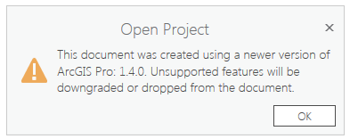

***************
Troubleshooting
***************

No option engine in section: envipyengine
=========================================

This error means the ENVI Py installation has not been configured to point to your ENVI/IDL taskengine executable.  Before running any task or GPTool, make sure you have completed the steps in the :ref:`envipyarc-installation-and-configuration` section which sets the path to the ENVI taskengine.

This document was created using a newer version of ArcGIS Pro
=============================================================

when opening the project template in ArcGIS Pro version 1.3 or earlier, you will get this warning message about dropping unsupported features.

The project templates provided are built with ArcGIS Pro 1.4 and package the python toolboxes so they are easily accessible. The templates are supported for ArcGIS 1.2 or newer and no features will be downgraded or dropped.

